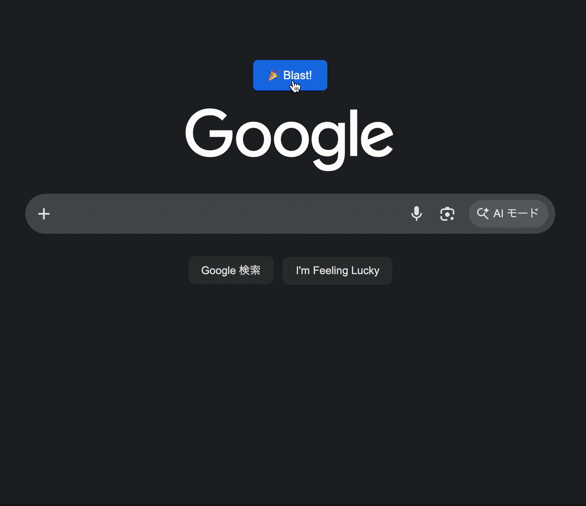
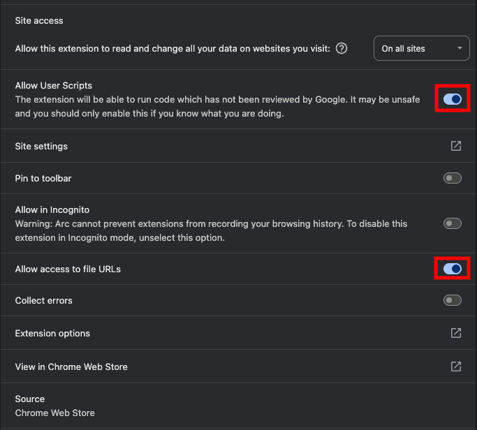
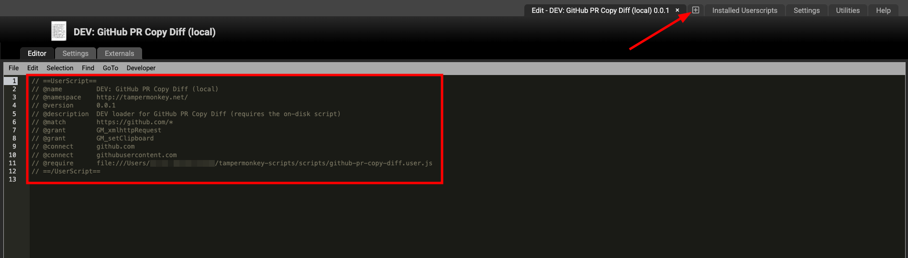

# Tampermonkey Scripts

> **Vibe code features into your favorite websites!**




Small userscripts that bolt new features onto sites you already use - Google, GitHub, Slack, Google Meet. Each one is a single file. Build your own with AI: edit the file, reload the page, see it live. No build step, nothing to compile.

## What's inside

<sub>Auto-generated from `greasyfork.json` - don't hand-edit between the markers.</sub>

<!-- scripts:start -->
| Script | What it does | Runs on | Install |
|---|---|---|---|
| [Gmeet++](scripts/gmeet-pp.user.js) | Auto-mute mic & cam on join, invert-colors button, random participant picker, and more for Google Meet | `meet.google.com` | [Greasy Fork](https://greasyfork.org/en/scripts/513815) |
| [GitHub PR Load All Comments](scripts/github-pr-load-all-comments.user.js) | Adds a "Load all!" button that expands every hidden conversation in a GitHub PR | `github.com` | [Greasy Fork](https://greasyfork.org/en/scripts/564954) |
| [GitHub PR Copy Diff](scripts/github-pr-copy-diff.user.js) | Adds a "Copy Diff" button to the PR nav that copies the unified diff to the clipboard | `github.com` | [Greasy Fork](https://greasyfork.org/en/scripts/581098) |
| [Langfinity Loby Defaults](scripts/langfinity-loby-defaults.user.js) | Turns off mic & camera in the Langfinity lobby and remembers your last-used name | `langfinity.ai/meeting` | [Greasy Fork](https://greasyfork.org/en/scripts/557742) |
| [Slack AI Translate](scripts/slack-ai-translate.user.js) | Adds an English/Japanese translation button to Slack messages and the composer | `app.slack.com` | [Greasy Fork](https://greasyfork.org/en/scripts/581056) (unlisted - direct link) |
| [Slack Auto-remove Preview](scripts/slack-auto-remove-preview.user.js) | Automatically removes link previews on your own Slack messages | `app.slack.com` | [Greasy Fork](https://greasyfork.org/en/scripts/581085) (unlisted - direct link) |
| [Google Emoji Blast](scripts/google-emoji-blast.user.js) | Adds a button to the Google home page that blasts emoji across the screen | `www.google.com` | [Greasy Fork](https://greasyfork.org/en/scripts/581196) (unlisted - direct link) |
| [Slack Quick Edit](scripts/slack-quick-edit.user.js) | Double-click your own Slack message to edit it (Cmd/Ctrl+Enter saves) | `app.slack.com` | [Greasy Fork](https://greasyfork.org/en/scripts/581216) (unlisted - direct link) |
| [Slack Todo Emoji](scripts/slack-todo-emoji.user.js) | Todo checkboxes in the Slack composer: double-click to add, click to cycle status, Tab indents, Enter continues the list | `app.slack.com` | [Greasy Fork](https://greasyfork.org/en/scripts/581231) (unlisted - direct link) |
| [Slack Composer Char Count](scripts/slack-composer-charcount.user.js) | Live character countdown in the Slack composer that warns before you hit the message limit | `app.slack.com` | [Greasy Fork](https://greasyfork.org/en/scripts/581666) (unlisted - direct link) |
| [GitHub PR Copy Title + Link](scripts/github-pr-copy-title-link.user.js) | Adds a button by the PR title that copies the title + PR link, ready to paste as a link in Slack, Notion, or markdown | `github.com` | [Greasy Fork](https://greasyfork.org/en/scripts/582750) |
| [Virtual Media Injector](scripts/virtual-media-injector.user.js) | Floating button that plays a pre-recorded video into your webcam and mic during a meeting, with live toggle back to your real camera | `*` | [Greasy Fork](https://greasyfork.org/en/scripts/583097) (unlisted - direct link) |
<!-- scripts:end -->

**Just want to use one?** Install the [Tampermonkey](https://www.tampermonkey.net/) browser extension, click the Greasy Fork link for any script above, and hit *Install*. That's the whole thing - no coding required.

## Build your own

The fun part. You edit a `.user.js` file on your machine, and Tampermonkey runs it on the live website. Reload the page to see each change.

### 1. Set up once

- Install **[Tampermonkey](https://www.tampermonkey.net/)** in **Chrome** (or any Chromium browser - Firefox can't load scripts from local files).
- Go to `chrome://extensions`, open Tampermonkey's **Details**, and turn on **Allow User Scripts** and **Allow access to file URLs**, then set **Site access -> On all sites**:

  

- Clone this repo and turn on the version hook (needs [Node](https://nodejs.org/)):

  ```sh
  git config core.hooksPath .githooks
  ```

### 2. Load a script from disk

In Tampermonkey, click the **+** to create a new script, then replace it with a tiny *dev loader* that points at the real file on your machine:



```javascript
// ==UserScript==
// @name         DEV: <script name> (local)
// @namespace    http://tampermonkey.net/
// @version      0.0.1
// @description  dev loader
// @match        <copy from the real script>
// @grant        <copy EVERY @grant from the real script>
// @connect      <copy every @connect, if it has any>
// @require      file:///absolute/path/to/scripts/<script>.user.js
// ==/UserScript==
```

Copy **every** `@grant`, `@connect`, and `@require` from the real script onto the loader - the loaded file's own header is ignored. Details and the gotchas that bite people: **[DEVELOPMENT.md](docs/DEVELOPMENT.md)**.

### 3. The loop

Edit the `.user.js` file -> reload the page -> your change is live. That's it.

> New here? [`scripts/google-emoji-blast.user.js`](scripts/google-emoji-blast.user.js) (the emoji button in the GIF above) is the simplest one to copy from: `@grant none`, about 40 lines.

## More

- **[DEVELOPMENT.md](docs/DEVELOPMENT.md)** - full local-dev guide, troubleshooting, and site-specific notes.
- **[PUBLISHING.md](docs/PUBLISHING.md)** - publishing to Greasy Fork and using this repo as a template.
- **[IDEAS.md](docs/IDEAS.md)** - the backlog.
